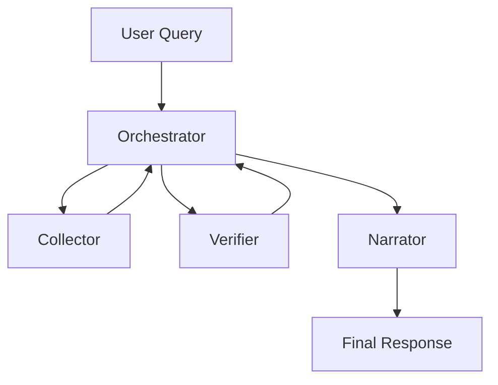

# AgentCore 🤖

A multi-agent news, weather, and knowledge assistant built with LangGraph, AWS Bedrock, and the Model Context Protocol (MCP). AgentCore orchestrates specialized agents to collect, verify, and present real-time information through a conversational interface.

**🔗 Live Demo:**  https://agentcore-udecdnmzvz5crengrsdlpf.streamlit.app/

> ⚠️ **Note:** The MCP tool server runs on Render's free tier, which sleeps after periods of inactivity — your first query may take longer while it wakes up.
>
> Each query also runs through a multi-agent pipeline (orchestrator → collector → verifier → narrator), involving several sequential LLM calls for accuracy. Typical response time is 15–35 seconds. This is a deliberate accuracy-over-speed tradeoff — a production version would parallelize agent calls and cache frequent lookups to reduce latency.

---

## What it does

Ask AgentCore about weather, breaking news, regional headlines, sports, business updates, or general knowledge, and it will:

1. Understand your query in context, resolving pronouns and follow-ups using chat history
2. Route it to the right data source
3. Fact-check the gathered information against live search
4. Return a clean, formatted, verified response

**Example queries:**
- "What's the weather in Mumbai, India?"
- "Latest news from the Middle East"
- "What's happening in football today?"
- "Tell me about the Eiffel Tower"

---

## Architecture

AgentCore uses a multi-agent orchestration pattern built on LangGraph's `StateGraph`, with tools served over MCP rather than bundled directly into the agent code.


---
**Two independently deployed services:**

| Service | Role | Hosted on |
|---|---|---|
| **MCP Server** (`server.py`) | Exposes tools (weather, news RSS, search, Wikipedia) over `streamable-http` | Render |
| **Streamlit App** (`stream_app.py`, `main.py`) | Chat UI, LangGraph orchestration, calls Bedrock + MCP tools | Streamlit Cloud |

The two communicate over HTTP — the Streamlit app is a stateless MCP client that fetches tool definitions from the Render-hosted MCP server at runtime.

---

## Tech Stack

| Layer | Technology |
|---|---|
| LLM Orchestration | LangGraph (`StateGraph`) |
| LLM Inference | AWS Bedrock (Amazon Nova) via raw `boto3` |
| Tool Protocol | Model Context Protocol (MCP), `streamable-http` transport |
| Tool Server | FastMCP |
| Frontend | Streamlit |
| Search Fallback | Tavily |
| News Sources | Regional RSS feeds, NewsAPI |
| Observability | LangSmith |
| Hosting | Render (MCP server) + Streamlit Cloud (UI) |

---

## Key engineering decisions

- **MCP over direct function calls** — decouples tools from the orchestration layer, so the tool server can be scaled, redeployed, or swapped independently of the UI
- **Regional news routing with keyword scoring** — `fetch_news()` scores RSS entries by keyword relevance rather than returning unranked results, falling back to Tavily search when no RSS match is found
- **Accuracy-over-speed pipeline** — a dedicated verifier agent independently checks collected data against live search before the response is written, at the cost of added latency

---

## Running locally

**1. Clone and install dependencies**
```
git clone https://github.com/VaibhaRagavan/AgentCore.git
cd AgentCore
python3 -m venv .venv
source .venv/bin/activate
pip install -r requirements.txt
```
**2. Set up environment variables**

Create a `.env` file in the project root:
```
AWS_ACCESS_KEY_ID=your_key
AWS_SECRET_ACCESS_KEY=your_secret
AWS_DEFAULT_REGION=us-east-1
OPENAI_API_KEY=your_key
LANGSMITH_API_KEY=your_key
TAVILY_API_KEY=your_key
WEATHER_API_KEY=your_key
NEWS_API_KEY=your_key
```
**3. Run the MCP server** (in one terminal)
```
python server.py
```
**4. Run the Streamlit app** (in another terminal)
```
streamlit run stream_app.py
```
---

## Roadmap

- [ ] Cognito authentication
- [ ] DynamoDB session persistence
- [ ] Parallelize agent calls to reduce latency
- [ ] Containrised approach to avoid wakingup the server

---


